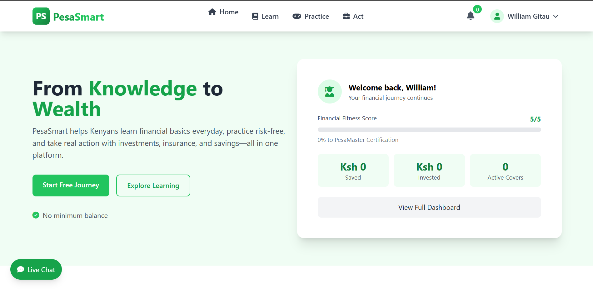
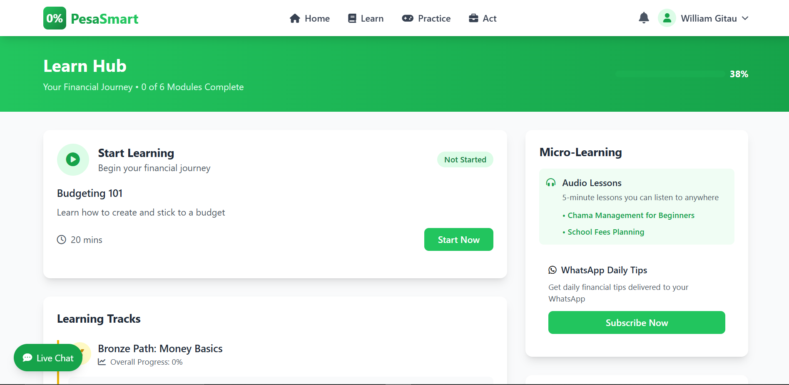
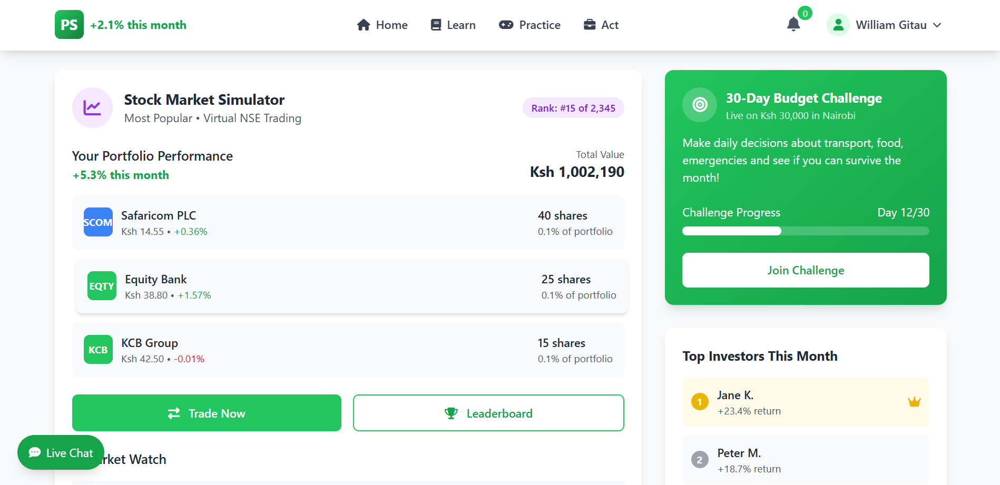
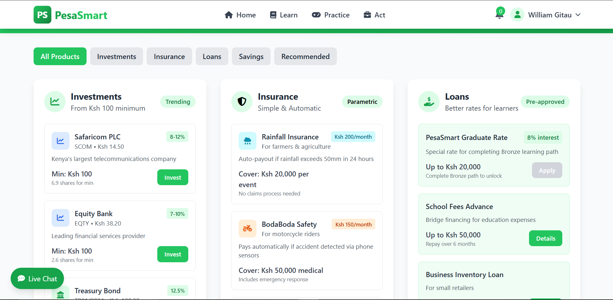

# PesaSmart 

## Contributors
 Gitau William
 ---

## Your Path to Financial Confidence

PesaSmart is a comprehensive fintech education platform designed specifically for the Kenyan market. It bridges the gap between financial literacy and real financial action through a three-phase journey: **Learn → Practice → Act**.

---

##  Problem Statement

76% of Kenyans lack basic financial literacy, resulting in:
- Only 2.5% insurance penetration
- Only 1 million NSE investors (out of 50+ million population)
- Vulnerability to predatory lending
- Inability to build generational wealth

---

##  Solution Overview

PesaSmart provides a guided financial journey:

| Phase | Description |
|-------|-------------|
| **Learn** | Kenyan-focused financial education modules with badges & certificates |
| **Practice** | Risk-free simulators for stocks, loans, insurance claims |
| **Act** | Real products with lowered barriers (Ksh 100 investments, parametric insurance, better loan rates) |

---

##  Design System

**Primary Colors:**
-  Green (growth, wealth)

**Typography:**
- Headers: Poppins
- Body: Roboto

**Layout:** Card-based, responsive grid

---

##  Key Features

-  **M-Pesa integration** - Payments, statements, round-ups
-  **Fractional investing** - From Ksh 100 minimum
-  **Parametric insurance** - Automatic claim payouts
-  **Gamified learning** - Badges, certificates, leaderboards
-  **Goal-based savings** - Visual progress tracking
-  **Community features** - Chama management, group learning


---

##  Tech Stack

| Technology | Purpose |
|------------|---------|
| **HTML5** | Structure |
| **Tailwind CSS** | Styling & responsive design |
| **Font Awesome 6** | Icons |

---

## Installation & Setup
To deploy this project locally, follow these steps:

1.  **Clone the Repository:**
    ```bash
    git clone [https://github.com/gitauwilly1/Pesa-Smart.git](https://github.com/gitauwilly1/Pesa-Smart.git)
    ```
2.  **Execution:** Open `index.html` in any modern web browser (Chrome, Firefox, Safari, or Edge). 

---

## Screenshots






---


## Known Bugs
There are no known bugs 

---

## License
* **License:** MIT License.

---

## Support and Information
**Email:** gitauwilly254@gmail.com
